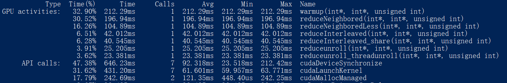

# 并行规约
## 线程束分化 reduceNeighbored VS reduceInterleaved(reduceNeighboredLess)
- inst_per_warp
- 线程束是基本执行单位，大小为32，以stride形式激活部分线程会造成严重的线程束分化，体现为inst_per_warp变大，即每个线程束上执行指令的平均数量。

## 合并访存 reduceInterleaved VS reduceNeighboredLess 
- gld_efficiency，gst_efficiency
- 虽然reduceNeighboredLess中线程以stride形式读取数据避免了线程束分化，但是造成了读取时的分化，即warp中相邻线程并非读取内存中相邻数据，从而无法合并访存。体现为gld_efficiency很低，25% VS 98%，如果完全合并则为100%

## 展开循环 reduceInterleaved VS reduceunroll VS reduceunroll_threadunroll
- block级别的展开：复用线程，首先将下一个block的值加到当前block上，即可以跳过下一个block的全部计算，可以提升接近2倍的速度提升
- 线程级别的展开：最后32个线程（一个warp）在规约的时候仍会产生分化，这个分化不可避免，但是由于所有的线程都在一个warp内，因此不需要进行全局的__syncthreads，由此节省了5次同步线程的过程。

## 使用shared_memory reduceInterleaved VS reduceInterleavedshared
- gld_transactions,gst_transactions
- 提前将当前block所用到的数据从global gst_transactions下降明显，节省了读写global memory的事务（时间）。

## nvprof结果

## 为什么shared版本提升不大？
- 是否和L1/L2 cache有关？